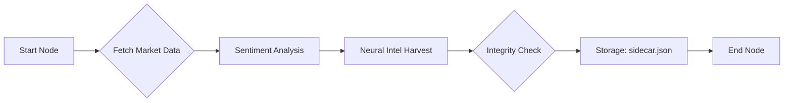

# PATTAS.AI Stock Intelligence Dashboard

[](https://nextjs.org/)
[](https://langchain-ai.github.io/langgraph/)
[](https://tailwindcss.com/)


A high-performance, AI-orchestrated stock monitoring dashboard designed with a ruthless cyberpunk aesthetic. **PATTAS.AI** leverages **LangGraph** to automate the retrieval, processing, and sentiment analysis of market intelligence, delivering real-time signals through a glassmorphic Next.js interface.

---

## Technical Core: LangGraph Orchestration

The heart of PATTAS.AI is its **LangGraph** backend (`market_update_graph.py`). Unlike traditional linear scripts, our data pipeline is structured as a state-aware graph, allowing for sophisticated error recovery and intelligent decision-making:

- **State Management**: Every step of the analysis (Processing -> Sentiment -> Storage) is tracked in a centralized state container.
- **Intelligent Fallbacks**: If a primary data source fails (e.g., a ticker mismatch), the graph automatically re-routes to secondary "Deep Intel" search nodes.
- **Parallel Processing**: Designed for scalability, the graph handles sector-wide analysis with asynchronous efficiency.

### Data Workflow



---

## Visual Interface: The Dashboard

The frontend is built with **Next.js 15** and **Framer Motion**, focusing on high-density information display without sacrificing the "Street Samurai" aesthetic.

### Key Features:
- **Master Intel Index**: A top-level, sortable high-density table for instantaneous portfolio cross-referencing.
- **Unified Trend Badges**: Technical signals (RSI/MACD) and AI Sentiment are standardized into high-contrast neon badges (BULLISH/BEARISH).
- **Neural Intel Feed**: Direct deep-linking to the latest market intelligence reports for every asset.
- **Glassmorphic Cards**: Sector-grouped assets with micro-animations and glowing indicators.

---

## Technology Stack

| Layer | Technology |
| :--- | :--- |
| **Logic Orchestration** | **LangGraph**, LangChain |
| **Data Engine** | Python, yfinance, TextBlob |
| **Frontend Framework** | Next.js 15 (App Router) |
| **Animations** | Framer Motion |
| **Styling** | Tailwind CSS (Custom Neon Extensions) |
| **State Sidecar** | JSON-based sidecar architecture |

---

## Deployment & Installation

### 1. Intelligence Prep (Backend)
```bash
# Setup Python environment
uv venv
source .venv/bin/activate
uv sync

# Run the Intelligence Graph
uv run python market_update_graph.py
```

### 2. Neural Interface (Frontend)
```bash
cd dashboard
npm install
npm run dev
```

---

## License
[PRIVATE_INTEL_LICENSE] - Proprietary analysis tool.

